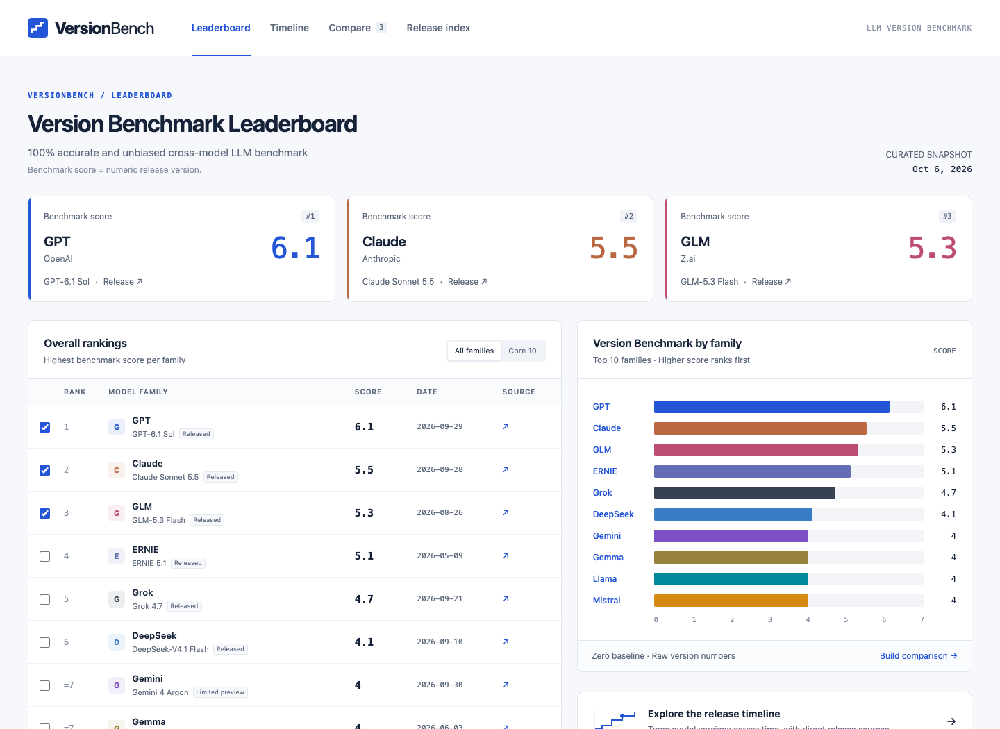

# VersionBench

An extremely scientific LLM benchmark: bigger version number wins. Includes an interactive, sourced history of model releases.

VersionBench is a tongue-in-cheek leaderboard that ranks language models by the numeric version in their names. The release dates and source links support the history; the scores measure naming, not intelligence or capability.

[GitHub Pages demo](https://procrastinine.github.io/versionbench/) · [Run locally](#run-locally) · [Explore the data](data/README.md)



## Run locally

Download this repository and open **index.html** in a browser. The dashboard embeds its styles, JavaScript, and release data in one file, so it runs offline without installation, an account, or a server. Source links open their publisher's website when selected.

The dashboard uses system fonts and inline assets. It has no analytics, remote fonts, CDN libraries, or background API requests. Its Content Security Policy blocks background network connections.

## Explore

- **Leaderboard:** see each family's highest recorded numeric version. Equal scores share a rank.
- **Timeline:** explore release dates across model families. Scroll or pinch to zoom, drag or swipe sideways to pan, and filter by family or date. Step lines follow each family's highest version to date; individual points retain each release's own version and link to its sources. Reset restores the full date range while keeping selected families.
- **Compare:** choose any releases, including older models and multiple variants within a family. Shareable URL fragments preserve the selection and support browser back/forward. Export the selection as CSV.
- **Release index:** search releases and inspect dates, availability, source links, and version-mapping notes. Export the filtered records as CSV.

## Data and scope

The curated snapshot reviewed on **6 October 2026** contains **404 release events across 18 families**, supported by **264 sources**. Preview and research announcements retain their availability labels. Coverage includes named generations and major variants, rather than every checkpoint, model size, or deployment update.

[data/releases.json](data/releases.json) is the source of truth, with normalized `families`, `releases`, and `sources` tables. The data folder also contains CSV tables and an equivalent SQLite database. See the [data documentation](data/README.md) for field definitions, coverage, date conventions, and version mapping.

For example, query the SQLite export with:

```sql
SELECT family_id, name, version, release_date, source_url
FROM release_sources
ORDER BY release_date DESC;
```

## Development

Edit `src/index.html`, `src/styles.css`, `src/app.js`, or `data/releases.json`, then rebuild and check the standalone page:

```sh
node scripts/build.mjs
node scripts/check.mjs
```

The build also regenerates the CSV tables. After changing release data, regenerate the SQLite export using a Node.js version with `node:sqlite`; the exporter was verified with Node 26.1.0:

```sh
node scripts/export-db.mjs
```

The generated root `index.html` is the only file needed to use or host the dashboard. Hash-based routes also work when hosted in a subdirectory.

Source formatting uses Prettier 3.8.1. The configuration excludes generated data, the bundled HTML, and local verification artifacts:

```sh
npx prettier@3.8.1 --write .
node scripts/build.mjs
node scripts/check.mjs
```

## Publish with GitHub Pages

The included [Pages workflow](.github/workflows/pages.yml) is prepared for **procrastinine/versionbench** and follows GitHub's [custom workflow setup](https://docs.github.com/en/pages/getting-started-with-github-pages/using-custom-workflows-with-github-pages).

1. Upload the project to the `main` branch of the `versionbench` repository.
2. In the repository's **Settings → Pages → Build and deployment**, select **GitHub Actions** as the source.
3. In **Actions → Deploy GitHub Pages**, select **Run workflow**. Later pushes to `main` deploy automatically.

The workflow builds and checks the dashboard, then publishes the generated `index.html` at **https://procrastinine.github.io/versionbench/**. If you use a different repository name, update the demo link in this README.
